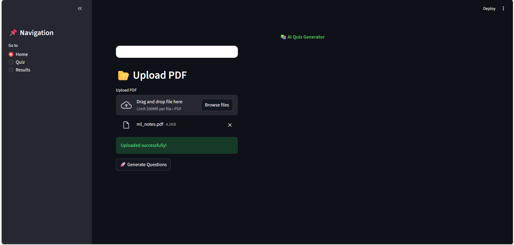
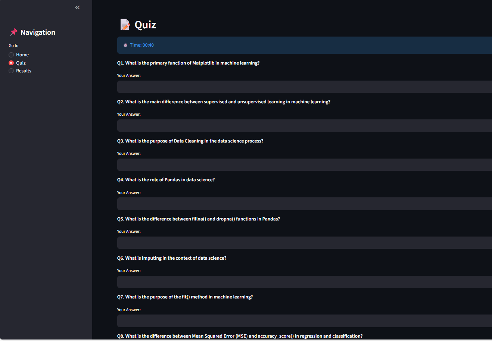
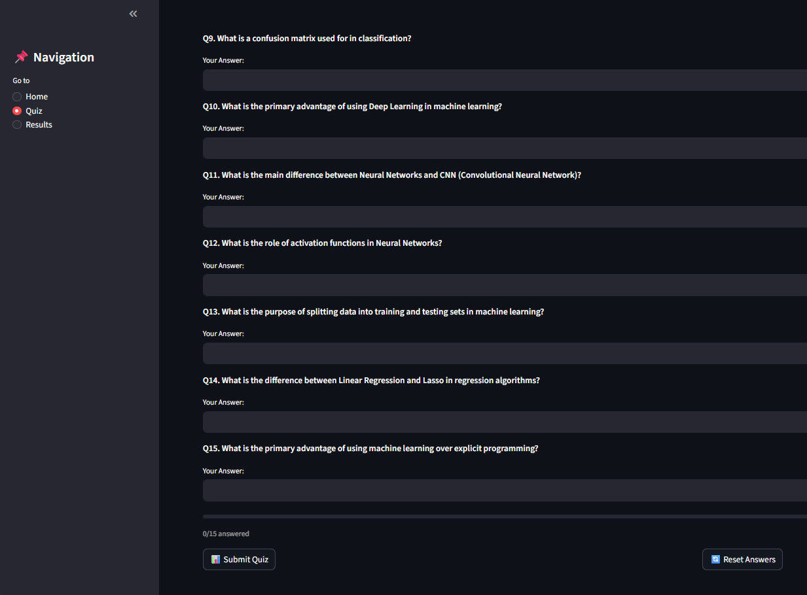
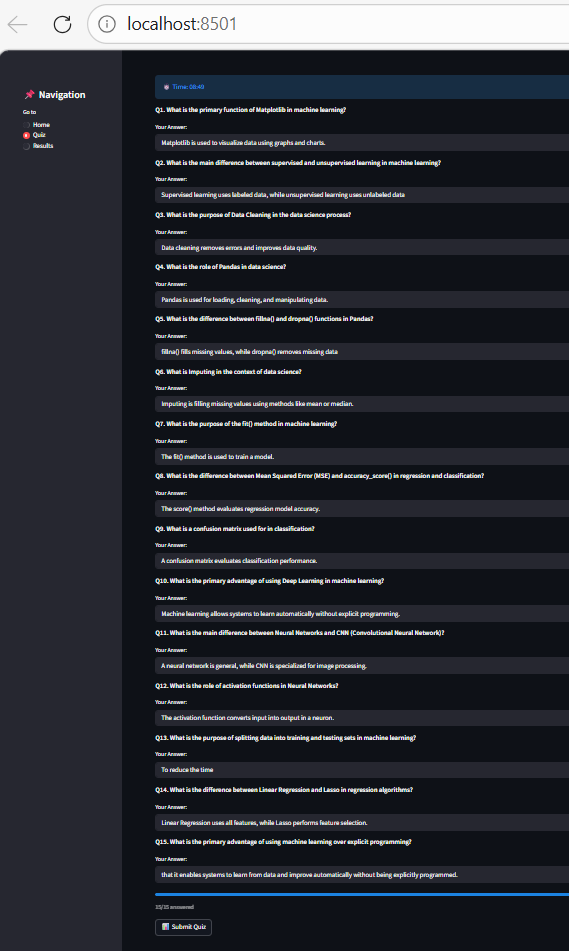
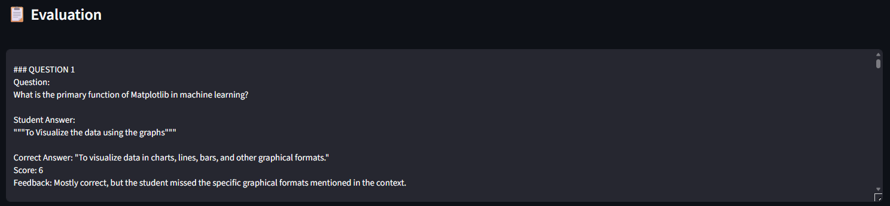
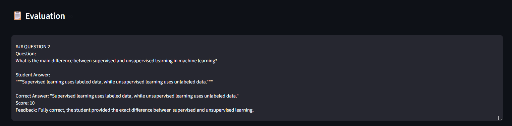
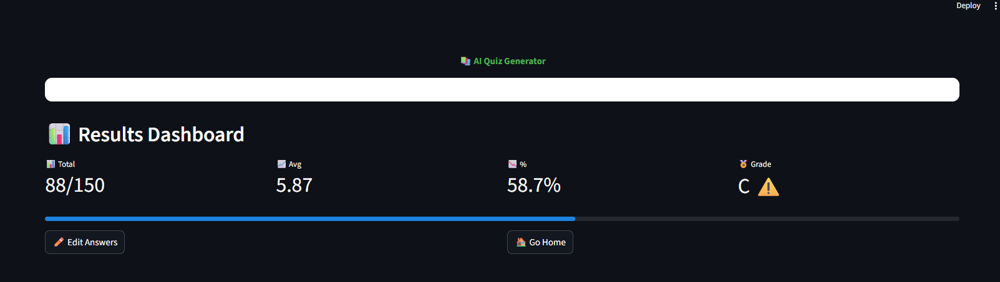

# 📅 Development Progress (5 Days)

---

## 📆 DAY 1: Research & Problem Understanding

### 🎯 Objective

To understand the problem and explore existing solutions in the industry.

### ✅ Work Done

* Selected Project 4: Quiz Application with Document-Based Question Generation
* Studied the problem statement in detail
* Performed research on existing systems:

  * Google Forms (manual quiz system)
  * ChatGPT (general Q&A)
  * Kahoot (interactive quizzes)
  * QuillBot
  * LongChain

### 🔍 Analysis
## Limitations of Existing Systems

1. ChatGPT
   - No structured quiz system
   - No automatic scoring mechanism
   - No tracking of user performance

2. Kahoot / Google Forms
   - Cannot generate questions automatically
   - Cannot evaluate descriptive answers
   - Limited to objective (MCQ) evaluation

3. LangChain
   - Provides building blocks only
   - No ready-to-use quiz system
   - Requires manual pipeline design

### ❌ Failed Attempt

* Tried generating questions directly from full document → output was irrelevant

### 🔧 Solution

* Decided to preprocess text before passing to LLM

### 💡 Learning

* Understanding the problem deeply is essential before implementation
* LLM performance depends on structured input

### Improvement Over Existing Systems

- Supports descriptive answer evaluation
- Fully automated pipeline
- Uses semantic understanding instead of keyword matching
- Works on open-source LLMs (Ollama)
---

## 📆 DAY 2: PDF Text Extraction Module

### 🎯 Objective
UI → Streamlit
LLM → Ollama
PDF → pdfplumber
Data → pandas
To extract meaningful text from user-uploaded documents.

### ✅ Work Done
* Created the Some files like test_evaluator.py, test_ollma.py,test_pdf.py,test_questions.py
* By Using sample Pdf i test the working of the ollama is correct or not
* Implemented PDF extraction using Python
* Successfully extracted raw text from PDF files

### 🔍 Analysis

* Extracted text included unnecessary content
* Large text input caused slow processing

### ❌ Failed Attempt

* pdfplumber is not that good to extract and read the pdf contents
* it failed for some pdf like marksheets
* it is scraping the wrong rows and columns

### 🔧 Solution

* I Used the PyMuPDF
* Which is most accuretely reading all the data from the given pdf

### 💡 Learning

* Preprocessing and filtering data improves performance and accuracy

---

## 📆 DAY 3: Question Generation System

### 🎯 Objective

To generate meaningful questions from extracted content.

### ✅ Work Done

* Built question generation module using Ollama (phi3 model)
* The phi3 model is the fast but not accurate one
* Added support for:

  * Topic-based questions
  * Difficulty level
  
* Then I move to the Mistral Model
* which is the best ollama model 
* But Mistral is Slow
  
### 🔍 Analysis

* LLM sometimes ignored instructions
* Output was inconsistent

### ❌ Failed Attempt

* Requested 15 questions → only 5 generated
* When I worked with mistral it is generating the questions like Wow But it is taking 3-4 min for question generation

### 🔧 Solution

* Improved prompt:
- Like, You must generate the Clear , Clarity and Correct Questions 
- Implemented batching strategy(Where it Covert the full pdf into the smaller chunks )
- Then generating the questions
 
### 💡 Learning

* Prompt engineering plays a critical role in LLM-based systems
* Clear instructions improve output quality
* Sometimes LLM Hallucinates

---

## 📆 DAY 4: Answer Evaluation System

### 🎯 Objective

To evaluate user answers intelligently using LLM.

### ✅ Work Done

* Developed evaluation module
* Compared student answers with extracted context
* The module 1st I used the mistral Which is slowly working taking 3 min time per question
* So I moved to the mistral:instruct which is fast than the mistral
* Generated:

  * Score
  * Feedback

### 🔍 Analysis

* Evaluation was accurate but very slow

### ❌ Failed Attempt

* Evaluating answers one-by-one → ~3 minutes per answer

### 🔧 Solution

* Implemented batch evaluation
* Reduced number of LLM calls
* Then evalution becomes faster for all questions now it is taking 5 - 6 min  

### 💡 Learning

* Performance optimization is critical in real-world systems
* Batch processing improves efficiency

---

## 📆 DAY 5: Optimization & Final Integration

### 🎯 Objective

To integrate all modules and improve system performance.

### ✅ Work Done

* Integrated:

  * PDF extraction
  * Question generation
  * Answer evaluation
* Cleaned project structure
* Added error handling

### 🔍 Analysis

* Initial system performance was slow
* So next i moved to the llama3.2:3b
* Which is taking the less than 1 min for question generation
* And also 3 to 4 min for the evaluation

### ❌ Failed Attempt

* Large input + multiple API calls → high latency
* also sometimes it hallucinates and not completely give feedback like why answer is wrong and why it is correct
* Sometimes if i give the wrong answer it will predict it as wrong

### 🔧 Solution

* Optimized prompts
* Reduced input size
* Improved batching

### 💡 Learning

* Optimization is as important as functionality
* Efficient system design is required for scalability

---
## 📸 Project Preview

 

 

### 📊 Final Results Dashboard

---

👉 **More Screenshots:**  
[View all images](images/)

---

## 📊 Final Outcome

* Built a complete quiz application
* Supports document-based question generation
* Evaluates descriptive answers using LLM
* Provides feedback and scoring 
* Improved performance significantly
* Add UI (Streamlit / Web app)
* Support multiple document formats
* Improve evaluation accuracy using fine-tuned models
* And It the Output also Downloadble like CSV file and PDF
---

## 🎥 Project Demo Video

👉 https://drive.google.com/file/d/1Q1abkhfeX8tPsH2qE_xE49ilDR6uQSYs/view?usp=sharing
👉 https://drive.google.com/file/d/1Q1abkhfeX8tPsH2qE_xE49ilDR6uQSYs/view?usp=sharing
